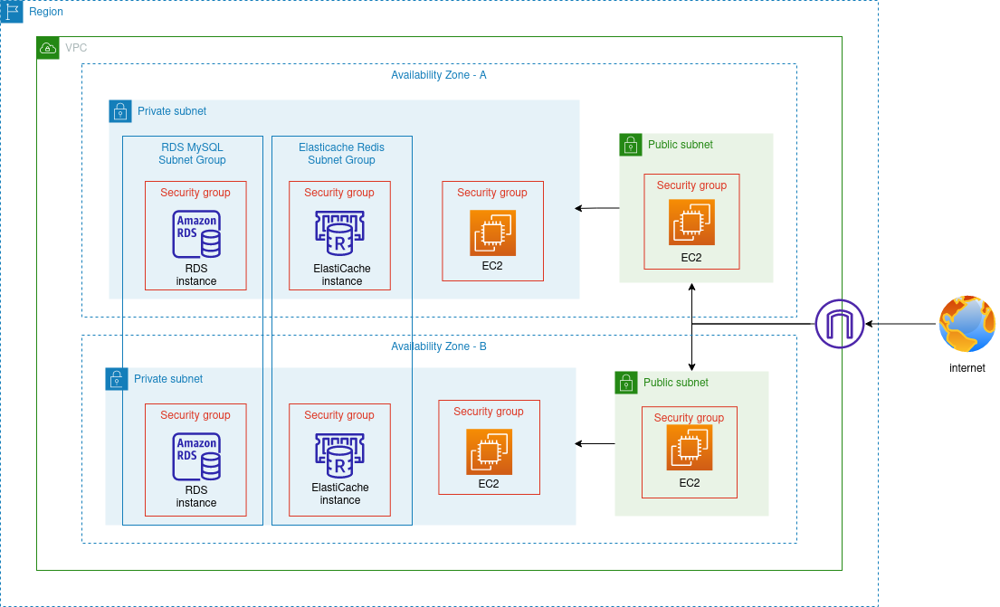

# Terraform Infrastructure Deployment

This repository contains the Terraform code to deploy infrastructure on AWS. It includes creating a VPC with two public and two private subnets, launching EC2 instances in the public and private subnets, and creating RDS and Elasticache instances.

## Architecture

The following diagram represents the architecture of the project:

<p align="center">
    
</p>

## Overview

This project uses Terraform to create the following AWS resources:

- VPC
- Internet Gateway
- Public Route Table
- Private Route Table
- Public EC2 instances
- Private EC2 instances
- RDS instance
- Elasticache instance

The project also includes two workspaces for deploying the infrastructure in different regions, and a script for auto-installing MySQL and Redis on the EC2 instances and scripts to auto connect to them.

## Getting Started

To get started with this project, clone this repository to your local machine:

```
$ git clone https://github.com/khgad/terraform-iti.git
```

## Prerequisites

Before running the deployment script, you will need to have the following:

- AWS account
- Terraform installed on your local machine
- AWS CLI installed on your local machine
- AWS credentials configured on your local machine
- A Secret Manager in AWS with the RDS database credentials stored (username, password)
- A S3 bucket to store the Terraform state file, and DynamoDB to use for state locking. You can include them in `backend.tf`

## Installation

1. Navigate to the project directory:

    ```bash
    $ cd terraform-cloud-infra-iti
    ```

2. Create the 2 workspaces

    ```bash
    $ terraform workspace new dev
    $ terraform workspace new prod
    ```

3. Initialize the Terraform configuration:

    ```bash
    $ terraform init
    ```

4. Apply the Terraform configuration:

    ```bash
    $ terraform apply
    ```

## Usage

After deploying the infrastructure, you can access the resources in the AWS Console or via the AWS CLI. You can also use the `inventory` file to view the public IP address of the Bastion EC2 instance:

```
$ cat inventory
```

## Variables

The following variables can be defined in the terraform.tfvars file:

- `CIDR`: a string representing the CIDR block for the VPC
- `COMPANY_NAME`: a string representing the company name, default is `ITI`
- `PUBLIC_SUB_1`: a string representing the ID of the first public subnet
- `PUBLIC_SUB_2`: a string representing the ID of the second public subnet
- `PRIVATE_SUB_1`: a string representing the ID of the first private subnet
- `PRIVATE_SUB_2`: a string representing the ID of the second private subnet
- `REGION`: a string representing the AWS region, default is `us-east-1`
- `AZ_1`: a string representing the first AZ, default is `us-east-1a`
- `AZ_2`: a string representing the second AZ, default is `us-east-1b`
- `INSTANCE_TYPE`: a string representing the instance type of the EC2 instances
- `AMI_IMAGE`: a string representing the AMI image ID, default is `ami-069aabeee6f53e7bf`
- `RDS_CREDS_SECRET`: a string representing the name of the secret containing the RDS credentials.

## Conclusion

With this Terraform code, you can create a VPC with public and private subnets in two different availability zones, launch EC2 instances with RDS and Elasticache instances, and set up a bastion host for accessing the private instances. By using modules and workspaces, you can easily manage the infrastructure for multiple environments.

Overall, this project provides a comprehensive infrastructure setup that includes networking, compute, database, and caching resources. It also implements best practices for Terraform, such as using modules, workspaces, and variable definition files. With this setup, you can easily deploy and manage your infrastructure in multiple environments and regions, while maintaining a high level of security and scalability.

## Author

- [Khaled Gad](https://linkedin.com/in/khgad)
